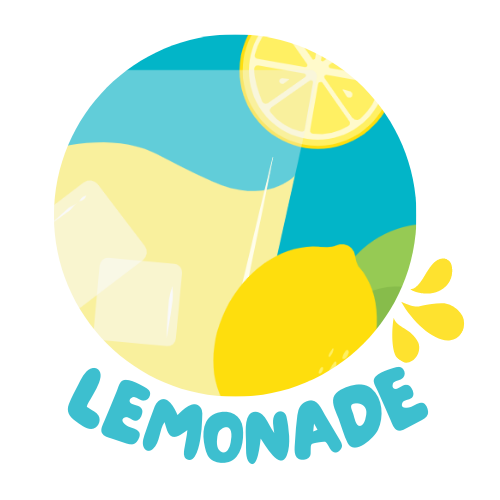
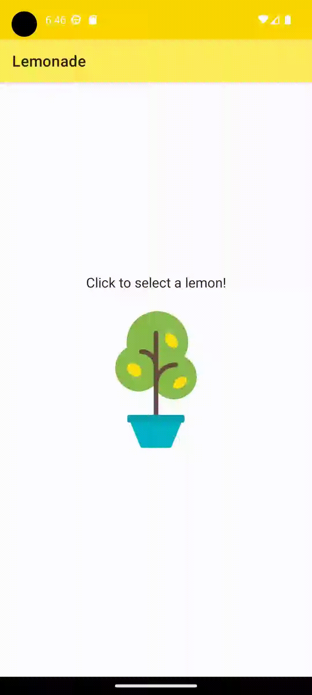

   

# Lemonade App

> When life gives you lemons, make lemonade!

  

## :rocket: About the project
This is my first independent project for [Android Basics in Kotlin](https://developer.android.com/courses/android-basics-kotlin/course).

Copyright 2021 The Android Open Source Project
